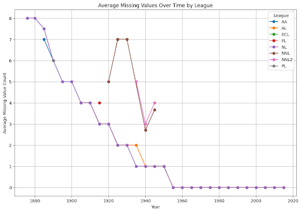

# Group 5 Data Essay

- ## CONTENT: 
  - **Narrative - Nick & Yosef & Ethan**
      - The project originally started as a research project into how statistics influenced sports betting on baseball. This idea was initially promising, however as we continued to research this idea, we realized the existing data and literature regarding baseball gambling was limited, sporadic, and usually unverifiable. Due to federal law, gambling of any manner was outlawed in 1992 until 2018, and records prior to this were not publicly available. Additionally, we had collected exactly zero gambling data when we came to the experimentation phase, and instead had only collected baseball statistics data from one singular year. 
      - It was very clear that our approach was not working. Therefore, Ethan suggested that we could instead examine the history of recordkeeping in baseball itself, from the depth, authenticity, longevity, and coverage of different leagues over time. To do this, we used baseball-reference.com, which has collected and kept records from various active and inactive baseball major leagues and is typically respected as a reputable source (more in limitations). Using built-in website functions, we data from every single league chronicled on the website from their inceptions. By collecting and combining every single league throughout history on this website, we could compare the metadata of each league and year. Mainly, we were interested in how the quantity of missing values and recorded parameters differed. Specifically, we collected pitching, batting, and detailed league team rankings from approximately every 5 years since 1871 (due to time and practicality reasons, we did not collect every single year).. This allowed us to visualize the difference in recorded parameters and missing values between different years and different leagues through data manipulation. 
      - With this dataset being complete, we still wanted to add a more humanities-focused aspect to our project; we collected quantitative records of baseball, but we still wanted to collect qualitative reports. So, we referenced Chronicling America. We wanted to compare the quantity and content of the newspaper coverage of each individual league, and examine how they changed over time. We used various methods to collect publication information (year, newspaper name, league, and url) on every single publication for each inactive major league -- this process would be impractical for the active major leagues due to the enormity of the historical record. With this information, we created an extremely large dataset, allowing us to compare the quantity of publications by league and over time. Using other methods, we also inspected the actual contents of articles, however this aspect was very limited. We initially wanted to go further in depth, using sentiment analysis to analyse the newspapers, however due to the unstructured nature of newspapers, as well as time constraints, we did not end up performing any sentiment analysis. With both of these datasets, we believe we were able to paint a relatively clear picture surrounding the history of major league baseball. 

  - **Methodology – Yosef & Ethan**
    - Firstly, we collected baseball statistics data from baseball-reference.com. This website strictly prohibits all automated data collection and scraping, so we resorted to manually collecting data using the website’s built in csv-export feature. Starting at the very beginning of the available records, for every single league and year, we collected pitching, batting, and detailed team standings records, combining them into one csv. The website’s export feature did not quite work as intended, as it often exported in different formats from one record to another. Additionally, since the amount of parameters changed over time and between league, we had to figure out a way to combine different csv records, with different formats and different column names into one large csv for easy data analysis. To do this, Ethan wrote a python script that iterates through each individual exported csv’s column names and identifies if the column names match exactly to the other records collected; if they don’t, the columns that are missing would be filled in with missing values (for instance, if we first read in a csv from 2015 with 15 columns, then we read in a csv from 1920 with 10 columns, the 5 missing columns would be treated as missing values). This process took a long time due to the amount of manual data cleaning that we had to do, as well as various other quirks of the dataset. Ultimately, we were left with three csvs, which we would read as pandas dataframe: batting.csv, pitching.csv, detailed_standings.csv. -Ethan
    - Next, we collected Chronicling America data using the Library of Congress’s built in API with the requests library. The API allows for basic automated search and retrieval of newspaper records, with limited parameters. Ethan wrote a script that, for each league, performs a search query, requiring results to have the word “baseball” and the phrase “[league name]”, then collects the article’s corresponding year of publication, newspaper, league, and url. This data was put into five separate csvs for five different leagues. However, some manual cleaning was required. For instance, a query on the baseball league ‘american association’, which was active for only 10 seasons, yielded approximately 60,000 results, ranging far beyond the league’s active years. The API did not allow for time constraints on queries, so we utilized post-processing on the results’ publication dates to trim the irrelevant results. -Ethan
    - In order to maintain data integrity, it was imperative that we kept the data as-is. That is, we did not impute or fill in any missing values. For data analysis and visualization, Yosef, Ethan, Nick, and Kohta used Python, implementing Pandas for data manipulation and Matplotlib, Seaborn, and Altair for visualization. Specifically, we used Matplotlib and Seaborn to create simple graphs that visualized missing values (from baseball-reference) over time, as well as quantity of publications (from Chronicling America). We created more in-depth, interactive graphs using Altair, to give a clearer picture of the differences between leagues. With Altair, we created graphs that separated both the baseball-reference and Chronicling America data by league (with interactivity). These visualizations were fairly easy to make, using basic features from each Python library.
    - We still felt we were under-utilizing the Chronicling America dataset, so we wanted to somehow visualize the content of the data that we collected. So, Ethan wrote a script that iterates through the URLs that we collected, used PyPDF2 to read the content of the newspaper, then read the text and filtered it by a RegEx function, looking for proper nouns, like people’s names, places, and team’s names. We wanted to use a more complicated method, like natural language processing, to do this, however up to this point, we had used Python3.13, and most NLP libraries use Python3.11 or earlier; we did not have the time to revert everything back to an earlier version, and there were a lot of issues with dependencies. Having collected proper nouns, the script then creates a word bubble visualization for each league/newspaper. In lieu of actual sentiment analysis, this was able to serve some utility in highlighting what topics were most covered in the newspapers. -Ethan
    - Throughout the project, team members collaborated extensively, to identify which visualizations best covered the data in the areas that we wanted to examine. We continuously revisited our methodologies to maximize the informational value of our project, ensuring that our data was accurate, relevant, and informative. By employing these methodologies, we were able to efficiently gather, analyze, and visualize our data, providing a solid foundation for our project and its objectives.

  - **Statistic Historical Context - Jason**

    - This graph displays the average number of missing values of the statistics that we compiled from baseball reference. Beginning with the National League in 1876, and later followed by the American Association in 1882. During this time statistics were mainly kept by hand so missing values were likely due to scorekeepers not fulfilling their responsibilities. The missing values are also due to some statistics simply not being tracked during the time. For example, the statistics: stolen bases, caught stealing, grounded into double plays, sacrifice hits, sacrifice flies, intentional walks, and runners left on base were all not tracked in the beginning of the American Association. These stats gradually began to be introduced into the leagues culminating in 1955 when all stats were finally introduced and tracked.

  - **Publication Historical Context – Sam**
    - The historical context of this data is that it is a bunch of newspaper pages that we found that mention specific professional baseball leagues. Overall, collecting this data shows us the evolution of sports media and baseball leagues over time as well as the role that newspapers can play as historical records. To collect our data, Ethan created a function which allowed us to search the entire newspaper API for whenever each league was mentioned. This would then be compiled into a new document which would have every single page of the newspaper that mentioned this specific league. We would then do this for all of the leagues that we are looking at and compare the number of times the leagues are mentioned over time. Additionally, we would be able to make a heat map using Altair in order to visualize the statistics and make them clearer to read. Some difficulties that we encountered when doing this was that some leagues like the American league and the National league have thousands of pages which takes a lot of time to run. We also continued to run into timeout errors with the API since we were all running the code and it would return an error eventually for everyone which required us to stop and take a break. This meant that it would take even more time than was initially anticipated. Another issue that we encountered is that some phrases seemed to appear a lot more than we would have expected. One example of this was the American Association which showed up as having 5000 pages but was a league which only existed for a few years. This did not add up, but we were able to filter the API by year and made the results more accurate.

  - **Complexities – Jason & Nick**
    - We had statistics from a different website called baseball savant, but we were never able to add it. The statistics from baseball reference took extremely long to transfer into datasets because we had to manually add in the data points. As a result, we did not have enough time to work on all of the data points from baseball savant, and we do not believe that those data points were extremely relevant. A lot of data was gathered through Baseball References by hand which took a fairly long time to complete despite only gathering data from every 5 years instead of every year. Additionally, the data needed extensive cleaning to make it usable for our project.

- ## LABOR DIVISION - Yosef
  - Data Gathering: Yosef, Ethan, Nick, Kohta
  - Data Analysis: Yosef, Ethan, Kohta
  - Statistics: Yosef, Ethan, Jason
  - Writing/Editing: Jason, Yosef, Kohta, Sam, Nick

- ## PURPOSE - Sam
  - The data that we collected can be used in many ways for many different purposes. In the present, the statistical data that we collected can be used to compare variable relationships and explore trends between two variables or a variable over time. It can also be used to predict future trends of the sport and use graphs to visualize which statistics will change over time. In the future, this data can be looked back on and seen how the game has evolved and what things have changed over time.