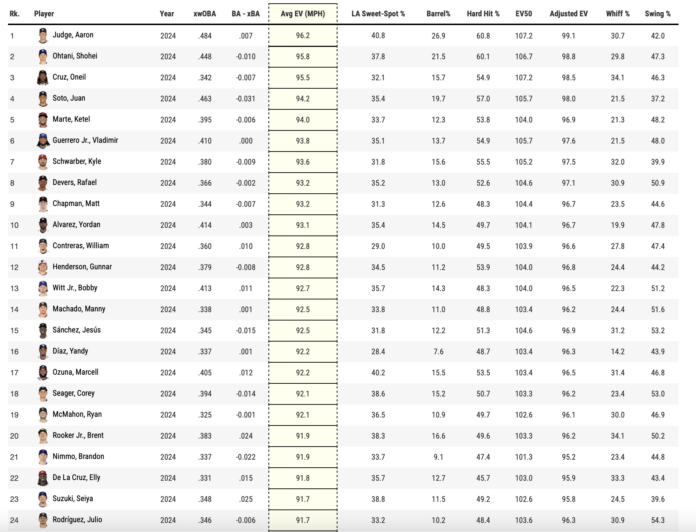

- The website we will be using: https://baseballsavant.mlb.com/leaderboard/custom?year=2024&type=batter&filter=&min=q&selections=xwoba%2Cxbadiff%2Cexit_velocity_avg%2Csweet_spot_percent%2Cbarrel_batted_rate%2Chard_hit_percent%2Cavg_best_speed%2Cavg_hyper_speed%2Cwhiff_percent%2Cswing_percent&chart=false&x=xwoba&y=xwoba&r=no&chartType=beeswarm&sort=exit_velocity_avg&sortDir=desc

- Terms of Use: https://www.mlb.com/official-information/terms-of-use
    - Very long and complicated.
    - In short, data on baseballsavant is allowed for all non-commercial use. 
    - Data is easily downloadable, and they even offer an API.

- Part 2 Step 1:
    - 

- Part 2 Step 2:
    - We will add a column that describes if we like each player or not.